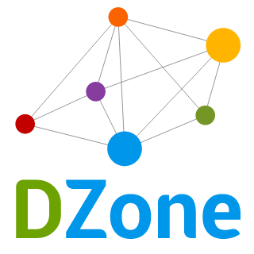

<p align="center">
  
</p>

<h1 align="center">
  Hello, I am Sameer. Let's Connect!👋
</h1>

<p align="center">
<a href="https://www.linkedin.com/in/sameershukla30/" title="LinkedIn">
  
</a>
<a href="https://www.freecodecamp.org/news/author/sameer-shukla/" title="freecodecamp">
  
</a>
<a href="https://dzone.com/users/4619787/sameer-shukla.html" title="dzone">
  
</a>
<a href="https://www.c-sharpcorner.com/members/sameer-shukla2" title="c#corner">
  
</a>
<a href="https://www.red-gate.com/simple-talk/author/sameer-shukla/" title="red-gate">
  
</a>
<a href="https://medium.com/@sameer.shukla" title="medium">
  
</a>
<a href="https://twitter.com/SameerKShukla" title="Twitter">
  
</a>
</p>

---

<h2> 👨🏻‍💻 &nbsp;A brief introduction about myself and my areas of interest.</h2>

```yaml
name: Sameer Shukla
about: >
  Director of Data & AI Architecture with 18+ years of experience in Software Design,
  Data Engineering, and AI/ML Systems. Published author, technical writer, and
  open-source contributor building production-grade agentic AI systems on AWS and Snowflake.
located_in: Dallas, Texas
current_job: Director of Data & AI Architecture
company: IntraEdge Technologies

education:
  [
    "Master of Computer Applications"
  ]

technical_background:
  [
    "Director of Data & AI Architecture",
    "Lead Software Engineer",
    "Principal Engineer",
    "System Architect"
  ]

fields_of_interests:
  [
    "Agentic AI Systems & LLM Orchestration",
    "LangGraph, LangChain, Claude (Anthropic), AWS Bedrock",
    "RAG, Hybrid Search, Vector Databases",
    "AWS: Lambda, Glue, DynamoDB, SQS, EventBridge, Step Functions, Bedrock",
    "Snowflake: Cortex AI, Cortex Search, Cortex Analyst, Snowpark",
    "Apache Spark & PySpark — Performance Engineering",
    "Apache Airflow — Pipeline Orchestration",
    "Master Data Management (MDM) & Data Quality",
    "Microservices & Distributed Systems — Kafka, Cassandra",
    "REST, GraphQL, SpringBoot, FastAPI",
    "GCP: Dataproc, Cloud Composer, Kubernetes, Spanner"
  ]

books:
  published:
    - title: "Optimizing PySpark: A Practical Guide to High-Performance Data Engineering"
      description: >
        Covers the Catalyst optimizer, shuffle reduction, data skew and salting,
        window functions, sort strategies, and logical plan analysis.
      link: "https://www.freecodecamp.org/news/how-to-optimize-pyspark-jobs-handbook/"

  upcoming:
    - title: "From Tokens to Agents: Understanding, Building, and Scaling Modern AI Systems"
      description: >
        A ground-up journey through modern AI — transformer architecture, RAG,
        advanced retrieval, and production agentic systems with LangGraph and Claude.
      status: "Under Publisher Review"
      companion_repo: "https://github.com/sameershukla/agentic-ai-lab"

    - title: "Agentic Systems in Production: Reliability, Observability, and Scale"
      description: >
        A practitioner handbook on running agentic AI in production — evaluation,
        observability, multi-agent orchestration, cost engineering, and security.
      status: "In Progress"

ai_contributions:
  [
    "Automated RCA system: EventBridge + Lambda + AWS Bedrock — debug time 30 min → 2 min",
    "Custom MDM platform with AI-assisted identity resolution on AWS",
    "NL-to-SQL agent with self-correction retry loops using LangGraph",
    "Snowflake Cortex AI: Cortex Search, Cortex Analyst, semantic views, customer 360",
    "DynamoDB-backed LangGraph checkpointers for stateful multi-agent workflows",
    "RAG pipelines: hybrid search (BM25 + dense), cross-encoder reranking, RAGAS evaluation",
    "Open-source agentic AI examples: ReAct, supervisor multi-agent, reflection, HITL"
  ]

currently_learning:
  [
    "Production reliability engineering for agentic systems",
    "MCP (Model Context Protocol) server design and enterprise integration",
    "Multi-agent orchestration patterns at scale",
    "Evaluation frameworks: RAGAS, LangSmith, Braintrust"
  ]

goals:
  [
    "Publish 'Agentic Systems in Production' as a definitive practitioner reference",
    "Publish Multiple Research Papers in the Digital Health and AI sector",
    "Grow agentic-ai-lab into a reference implementation repo for AI engineers"
  ]

achievements:
  [
    "Apache Airflow: Contributor of the Month Award Winner",
    "Best Paper Award Winner: IJCSEOnline",
    "C#Corner: Most Valuable Professional & Member of the Month Award Winner",
    "DZone: Premier Tech Blogger & Best of the Week Articles",
    "50+ Published Technical Articles across AI, Data Engineering, and Cloud",
    "Author: Optimizing PySpark (published)",
    "Author: From Tokens to Agents (under publisher review)"
  ]

contact:
  website: "https://sameershukla.me/"
  github: "https://github.com/sameershukla"
  linkedin: "https://www.linkedin.com/in/sameershukla30/"
  companion_repo: "https://github.com/sameershukla/agentic-ai-lab"
```

---

<h2> 📚 &nbsp;Books</h2>

<table>
  <tr>
    <td valign="top" width="33%">
      <b>Optimizing PySpark</b><br/>
      <i>✅ Published</i><br/><br/>
      A practical guide to high-performance data engineering — Catalyst optimizer, shuffle reduction, data skew, window functions, and logical plan analysis.<br/><br/>
      <a href="https://www.freecodecamp.org/news/how-to-optimize-pyspark-jobs-handbook/">Read →</a>
    </td>
    <td valign="top" width="33%">
      <b>From Tokens to Agents</b><br/>
      <i>📋 Under Publisher Review</i><br/><br/>
      A ground-up journey through modern AI — from LLM fundamentals through RAG, advanced retrieval, and production agentic systems with LangGraph and Claude.<br/><br/>
      <a href="https://github.com/sameershukla/agentic-ai-lab">Companion Repo →</a>
    </td>
    <td valign="top" width="33%">
      <b>Agentic Systems in Production</b><br/>
      <i>✍️ In Progress</i><br/><br/>
      A practitioner handbook on reliability, observability, evaluation, and scale for production agentic AI systems built on AWS.
    </td>
  </tr>
</table>

---

<h2> 🤖 &nbsp;AI & Agentic Systems</h2>

- 🔁 &nbsp;Built an **automated RCA system** (EventBridge → Lambda → AWS Bedrock → Claude) — reduced debugging time from 30 min to 2 min
- 🧠 &nbsp;Designed a **custom MDM platform** with AI-assisted identity resolution, survivorship rules engine, and data stewardship UI on AWS
- 🔍 &nbsp;Built **Snowflake Cortex AI** pipelines — Cortex Search, Cortex Analyst, semantic views, embedding-based customer 360
- 💬 &nbsp;Built an **NL-to-SQL agent** with LangGraph self-correction retry loops and schema grounding
- 🗂️ &nbsp;Implemented **DynamoDB-backed LangGraph checkpointers** for stateful, resumable multi-agent workflows
- 📦 &nbsp;Built production **RAG pipelines** — BM25 + dense hybrid search, cross-encoder reranking, RAGAS evaluation harnesses
- 🤝 &nbsp;Open-sourced progressive **agentic AI examples**: ReAct agent, supervisor multi-agent, reflection agent, human-in-the-loop workflows

---

<h2> 🚀 &nbsp;Tools I Have Used and Learned</h2>
<p align="left">
<a href="https://cassandra.apache.org/" target="_blank" rel="noreferrer">  </a> <a href="https://www.docker.com/" target="_blank" rel="noreferrer">  </a> <a href="https://firebase.google.com/" target="_blank" rel="noreferrer">  </a> <a href="https://cloud.google.com" target="_blank" rel="noreferrer">  </a> <a href="https://git-scm.com/" target="_blank" rel="noreferrer">  </a> <a href="https://grafana.com" target="_blank" rel="noreferrer">  </a> <a href="https://hadoop.apache.org/" target="_blank" rel="noreferrer">  </a> <a href="https://www.java.com" target="_blank" rel="noreferrer">  </a> <a href="https://www.jenkins.io" target="_blank" rel="noreferrer">  </a> <a href="https://kafka.apache.org/" target="_blank" rel="noreferrer">  </a> <a href="https://www.elastic.co/kibana" target="_blank" rel="noreferrer">  </a> <a href="https://kubernetes.io" target="_blank" rel="noreferrer">  </a> <a href="https://www.linux.org/" target="_blank" rel="noreferrer">  </a> <a href="https://www.microsoft.com/en-us/sql-server" target="_blank" rel="noreferrer">  </a> <a href="https://www.mysql.com/" target="_blank" rel="noreferrer">  </a> <a href="https://www.oracle.com/" target="_blank" rel="noreferrer">  </a> <a href="https://pandas.pydata.org/" target="_blank" rel="noreferrer">  </a> <a href="https://www.postgresql.org" target="_blank" rel="noreferrer">  </a> <a href="https://www.python.org" target="_blank" rel="noreferrer">  </a> <a href="https://pytorch.org/" target="_blank" rel="noreferrer">  </a> <a href="https://redis.io" target="_blank" rel="noreferrer">  </a> <a href="https://seaborn.pydata.org/" target="_blank" rel="noreferrer">  </a> <a href="https://spring.io/" target="_blank" rel="noreferrer">  </a>
</p>

---

<h2> 📈 &nbsp;My GitHub History!</h2>
<a href="https://github.com/sameershukla">
  
  
</a>

<p align="left">
  
</p>
